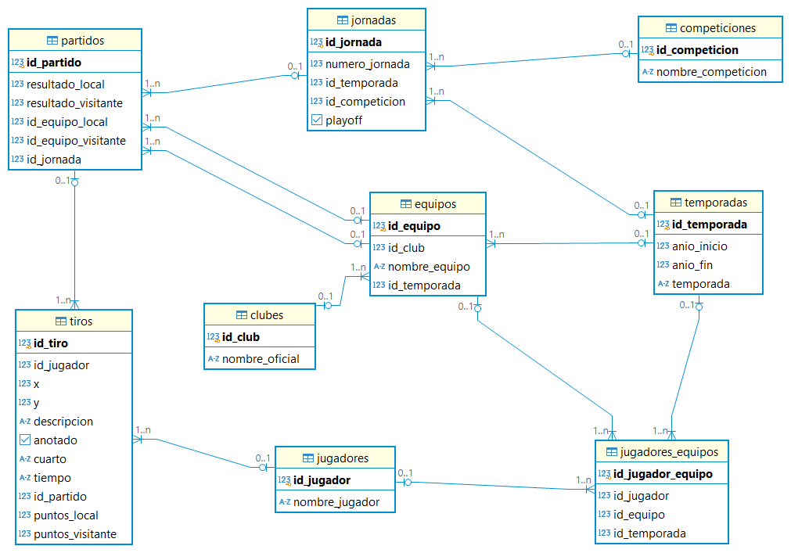
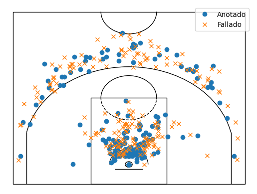

# ACB_DB


`acb_db` is a Python package designed to scrape and manage data from the official ACB (Spanish Basketball League) website. It allows users to keep an up-to-date database of match statistics, player stats, and other relevant data related to the ACB league. The data is stored in a PostgreSQL database, which can be easily updated by running the provided scripts.

## Features

The `acb_db` package offers the following key features:

1. **Round Data Scraping**:  
   Scrapes match data from the official ACB website, including match statistics, player performance, and more. This is executed per matchday, ensuring the database is always up-to-date.

2. **Data Processing and Dynamic Tables**:  
   Once match data is scraped, the package processes it and updates dynamic tables in the database, such as match statistics, player stats, etc.

3. **Database Update**:  
   Updates the database with new match data after each game. It allows users to integrate new match results into their existing database seamlessly.

4. **Modular Workflow**:  
   The workflow is modular, with distinct scripts for scraping data, processing it, and updating the database. This provides flexibility to run specific tasks as needed.

## Visual Representation

Below is a visual representation of the database schema.


## Requirements

- Python 3.10 (tested only on Python 3.10 and 3.12)
- pip (Python package manager)
- Google Chrome (tested with version 131) and compatible ChromeDriver
- Dependencies specified in `requirements.txt`. 

## Installation

### 1. Clone the repository

First, clone this repository to your local machine. Open a terminal and run:

```bash
git clone https://github.com/PabloDMC/ACB_DB.git
cd ACB_DB
```

### 2. Create and activate a virtual environment

It is recommended to create a virtual environment to avoid conflicts with globally installed dependencies.

```bash
python -m venv .venv
.venv\Scripts\activate
```

### 3. Install dependencies

Install the required dependencies listed in `requirements.txt`:

```bash
pip install -r requirements.txt
```

### 4. Configure the .env file
This project uses a `.env` file to manage sensitive configuration variables such as database credentials. Create a `.env` file in the root directory of the project with the following format:

```dotenv
DB_NAME='your_database_name'
DB_USER='your_database_user'
DB_PASSWORD='your_database_password'
DB_HOST='your_database_host'
DB_PORT='your_database_port'
```

#### Description of Variables:
* DB_NAME: The name of the database to connect to.
* DB_USER: The username with access privileges for the database.
* DB_PASSWORD: The password associated with the database user.
* DB_HOST: The host address of the database server (e.g., localhost or a remote IP).
* DB_PORT: The port number where the database server is running (default for PostgreSQL is 5432).

After creating the `.env` file, the application will automatically load these variables during execution to configure the database connection.

## Using as a Package

This project is configured as an installable package. You can install it locally by running the following command from the root of the project:

```bash
git clone https://github.com/PabloDMC/ACB_DB.git
cd ACB_DB
pip install .
```

Once installed, you can import and use the modules in other Python projects. Below are a few examples of how to use the package:

### Example: Importing from the Scraping and Presentation modules:
```python
# Instanciar clase.
from acb_db.Scraping.scraper import ScraperACB
musa = ScraperACB()

# Partidos de Dzanan Musa en la temporada 2021-2022.
partidos_musa = musa.obtener_id_partidos_jugador('30001170','2021')

# Se iteran los partidos que jugó Musa para obtener sus lanzamientos.
tiros_musa = []
for i in partidos_musa:
    tiros_musa.extend(musa.obtener_tiros_jugador('D. Musa',i))
musa.cerrar_driver()

# Conversión a dataframe.
import pandas as pd
df = pd.DataFrame(tiros_musa, columns=[
                    'nombre', 'x', 'y', 'cuarto', 'tiempo', 'equipo_local',
                    'resultado_local', 'resultado_visitante', 'equipo_visitante', 
                    'descripcion', 'anotado', 'id_partido',
                    'id_jornada', 'temporada', 'competicion', 'playoff'
                ])

# Transformacion lineal de las coordenadas de los tiros. 
import numpy as np
df = df.astype({'x':'float', 'y':'float'})
df['coord_x']=df['x']
df['coord_y']=df['y']
df['y'] = np.where((df['coord_x'] - 24.750) * 6 < 1400,
                      (df['coord_x'] - 24.750) * 6,
                      abs((df['coord_x'] - 24.750) * 6 - 2800))
df['x'] = np.where((df['coord_x'] - 24.750) * 6 < 1400,
                      (df['coord_y'] - 141.25) * 6,
                      -(df['coord_y'] - 141.25) * 6)

# Tiros realizados por Dzanan Musa durante su temporada de MVP (2021-2022)
from acb_db.Presentation.court import shot_chart
shot_chart(df[df['anotado']==True],df[df['anotado']==False])
```
## Dzanan Musa (2021-2022)

